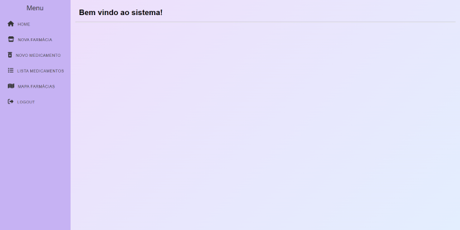

<h1 align="center">Pharma Kontroll</h1>

<p align="center">
  <a href="#-tecnologias">Tecnologias</a>&nbsp;&nbsp;&nbsp;|&nbsp;&nbsp;&nbsp;
  <a href="#-projeto">Projeto</a>&nbsp;&nbsp;&nbsp;|&nbsp;&nbsp;&nbsp;
  <a href="#-layout">Layout</a>&nbsp;&nbsp;&nbsp;|&nbsp;&nbsp;&nbsp;
  <a href="#memo-licença">Licença</a>
</p>

<p align="center">
  
</p>

<br>

<p align="center">
  
</p>

## 🚀 Tecnologias

Esse projeto foi desenvolvido com as seguintes tecnologias:

- HTML e CSS: para criar a estrutura e o estilo da aplicação. 
- JavaScript e React: para criar interatividade e interfaces de usuário dinâmicas, permitindo o cadastro e acesso eficiente aos dados.
- [`Vite`](https://github.com/vitejs): para compilação e desenvolvimento.
- Git e Github: para gerenciamento e controle do código-fonte de maneira centralizada.

## 💻 Projeto

Uma aplicação web para cadastro de medicamentos e farmácias. Oferece também funcionalidade de cadastro e autenticação de usuários por meio de e-mail e senha. É possível cadastrar medicamentos, consultar os medicamentos já registrados e obter detalhes de cada medicamento de maneira fácil e intuitiva, por meio de um painel que exibe todos os registros inseridos na aplicação.

Além disso, a aplicação permite o cadastro de farmácias, incluindo informações de contato e sua localização geográfica. As farmácias cadastradas são automaticamente inseridas em um mapa que exibe marcadores com a localização exata de cada estabelecimento. Os usuários têm a capacidade de entrar em contato diretamente com as farmácias, seja via WhatsApp Web ou o aplicativo WhatsApp, por meio de um link que contém o número de celular cadastrado na aplicação.

## 🔖 Layout

Para implementação das funcionalidades foram desenvolvidas as seguintes páginas:

### 1. Login de Usuário
Permite realizar autenticação de usuário através de email e senha para acesso a aplicação.
### 2. Cadastro de Usuário
Utilizado para registrar emaile senha escolhida pelo usuário.
### 3. Home da Aplicação
Tela de boas vindas a aplicação.
### 4. Cadastro de Medicmaneto
Página de formulário para realizar registro de um novo medicamento. 
### 5. Cadastro de Farmácia
Página para cadastro de uma nova farmácia, realiza consulta do CEP inserido e preenchimento automático do endereço através do serviço [Via CEP](https://viacep.com.br/).
### 6. Lista de Medicamento
Exibe todos os medicamentos cadastrados. Permite acessar todas as cadastradas do medicamento com click em sua imagem ou nome. Também é possível relizar busca por nome do medicamento e filtrar por tipo de medicamento.
### 7. Mapa de Farmácias
Exibe mapa com marcadores de todas as farmácias cadastradas. No marcador de localização e possível ter acesso a todas as informações da farmácia cadastrada e também com um clink no link de número de celular abrir automaticamente o aplicativo WhatsApp para iniciar uma conversa.

## 🏃 Iniciando o Projeto
Primeiro clone este repositório remoto em sua máquina local:

[git@github.com:denisonkolling/pharmacy-front.git](git@github.com:denisonkolling/pharmacy-front.git)

Lembre-se de adicionar as dependências do projeto:

```bash
npm install
# ou
yarn install
```

Inicie o servidor de desenvolvimento:
```bash
npm run dev
# ou
yarn run dev
```

Acesse [http://localhost:5173/](http://localhost:5173/) com seu navegador para acessar a aplicação.

## 💹 Possíveis Melhorias

Como a aplicação está atualmente em estágio de protótipo funcional podem ser aplicadas diversas melhorias ou criação de novas funcionalidades:
- Opção de editar ou remorer registro de medicamento ou farmácia.
- Integração com Backend e Banco de Dados para armazenamento dos registros da aplicação.

## 📝 Licença

Esse projeto está sob a licença MIT.

---